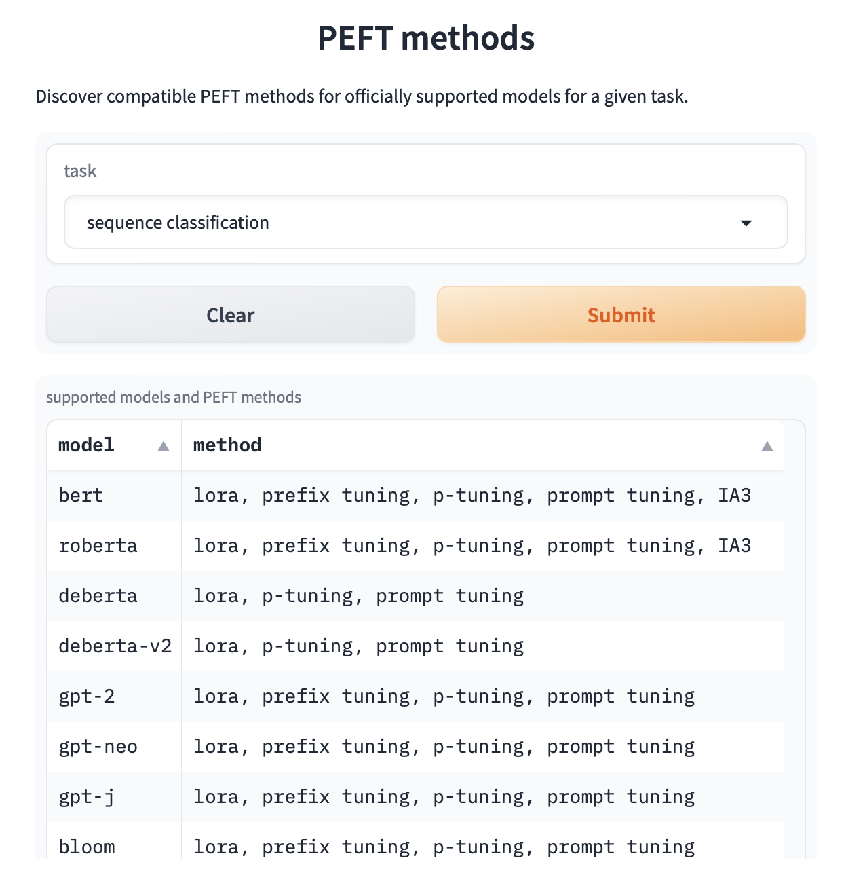

## Loaders
The `loader` directory contains modules for loading and managing models and datasets for sequence classification tasks.

### Modules

- **transformer.py**: This module is responsible for loading Hugging Face transformers from a configuration file. It includes classes and functions for model training and evaluation.
- **datatokenizer.py**: This module handles data tokenization and dataset preparation for training models.

### PEFT
Supported base models for Parameter Efficient Fine Tuning for Sequence Classification tasks.

## Documentation
#### MLFlow Training Summary
Placeholder section to include summary details on the training job run. The metrics below will reflect the latest successful run.
    